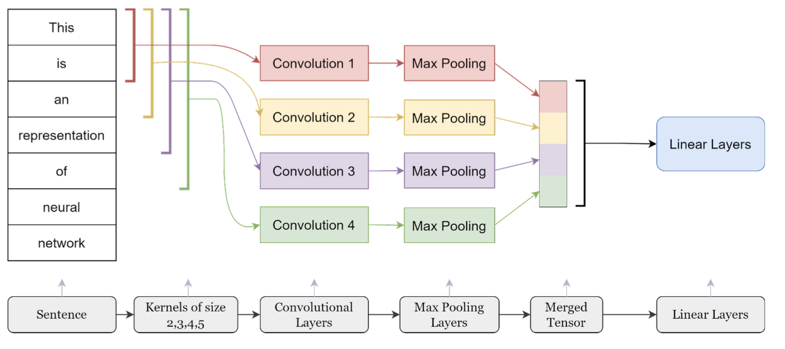

\newpage
```{r setup, include=FALSE}
knitr::opts_chunk$set(echo = TRUE)
library(kableExtra)
library(cowplot)
library(ggplot2)
library(magick)
```

### Introduction
In this project, we implemented different generative and discriminative models to achieve the book genre classification. The dataset is on [kaggle](https://www.kaggle.com/datasets/athu1105/book-genre-prediction). The main objective is to predict the genre of the book based on the synopsis of the book. In the report, details of models and results will be expanded. We will also discuss the situations where each approach performs well and poorly.

### Data Processing

#### Dataset\newline
There are 10 different classes in the dataset. Table 1 below shows the number of books in different genres. Psychology, sports, travel and romance have only about 100 data samples for each. These samples are too small to train and influence the prediction and validity of the model, therefore these three genres are ignored. Hence only six other classes are used for further processing. To generate a balanced dataset, only 500 samples are randomly selected from each genre. 

```{r table, echo=FALSE}
Genre <- c('psychology','sports', 'travel','romance','crime','history','horror',
           'science','fantasy','thriller')
Number <- c(100,100,100,111,500,600,600,647,876,1023)
class.df<- data.frame(Genre,Number)
knitr::kable(class.df, 
             caption = "Number of Books for Different Genres")%>%
  kable_styling(latex_options = "HOLD_position")
```

Before building the model, we still need to do some preprocessing to the text data. Removing punctuations and special characters is the first step. Removing stop words, and applying lemmatization are also key procedures in the NLP problems. Stop words are removed using the python package nltk. Lemmatization usually refers to doing things properly with the use of a vocabulary and morphological analysis of words, normally aiming to remove inflectional endings only and to return the base or dictionary form of a word, which is known as the lemma.

#### CountVectorizer\newline
CountVectorizer is a great tool provided by the scikit-learn library in Python. It is used to transform a given text into a vector on the basis of the frequency (count) of each word that occurs in the entire text. After transformation, the length of the vector will be the length of the unique words in the corpus. Each position records the appearances of corresponding words at that index. 

#### TfidfVectorizer\newline
TF-IDF is an abbreviation for Term Frequency Inverse Document Frequency. Since it has been taught during class, we will not expand the expressions here. TfidfVectorizer is to convert a collection of raw documents to a matrix of TF-IDF features. 

#### Word Embedding\newline
In natural language processing, word embedding is a term used for the representation of words for text analysis, typically in the form of a real-valued vector that encodes the meaning of the word such that the words that are closer in the vector space are expected to be similar in meaning. Because of the unequal length of summary for each book, we implemented two different word embedding methods to handle this situation. 

The first method is to calculate the average vector to represent the whole summary, and we call it the average document vector. The second method is widely used by many models. Setting a cut length and for text greater than the length, only keep the words within the set length; while for text shorter than the length, zero padding to reach the set length. In this way, we can have all vectors to become the same size. 

**To check the coding of data processing, please refer to `processing` and `ready_to_train` files.**

### Methods

#### Generative Models
Here we utilized two generative models, Latent Dirichlet Allocation (LDA) and Multinominal Naive Bayes. After training, we then generated two datasets to testify the effectiveness of these two methods.

##### Latent Dirichlet Allocation(LDA)\newline
LDA model is a widely used method in topic modeling and the model can help identify documents based on representative words. Since this method was discussed in class, the details of the method mechanism are not presented here in the report. However, the important assumptions are listed to a) the raw puts are collection of words, thus ignoring the order of words and grammatical rules of words and b) the number of topics are pre-determined. 

We decided to use LDA model as our generative model because we assumed that some topics existed within the summary of each category and we could use these topics to infer which category these texts belonged to. For LDA model, we have two important parameters, alpha that determines determines both the distribution and concentration of the dirichle and the topic-term distribution. These two parameters were also used in the synthetic data generation process. 

##### Naive Bayes\newline
After modeling our data using LDA, the accuracy rate was not satisfying. As a result, we also tried Naive Bayes, aiming to compare these two results. In statistics, naive Bayes classifiers are a family of simple "probabilistic classifiers" based on applying Bayes' theorem with strong independence assumptions between the features. They are among the simplest Bayesian network models, but coupled with kernel density estimation, they can achieve high accuracy levels. Therefore, as a typical example in generative models, Naive Bayes was also implemented in our project. 

#### Discriminative Models

##### TextCNN\newline
The TextCNN refers to n-grams of words and different kernel sizes will be applied to the same sentence. Then, each of the outputs of these kernels will be reduced using the max pooling function. Finally, each of these outputs will be concatenated in a single tensor to be introduced to a linear layer which will be filtered by an activation function to obtain the final classification results. The figure 1 shows the schematic diagram of the TextCNN model.
```{r figure 1, echo=FALSE, fig.cap = "Figure 1: TextCNN Model", out.width="70%",fig.align="center"}

```
##### NN Structure
NN neural network is a simple but effective method as a discriminative model, especially when the data is simple as well. As we mentioned above, when we adopt pre-processing algorithms which lead to simple outputs, like CountVectorizer, TfidfVectorizer , and average document vector, NN structure can help us to achieve a good classification. 

### **Results & Evaluations**

#### Generative Model

##### Latent Dirichlet Allocation(LDA)
The LDA model takes in the (word, frequency) for each topic and the `gensim model` provided an automatic transformation process and corresponding code. As a result, we utilized the clean text column generated after data processing.

```{r table2, echo=FALSE}
Genres <- c('crime','fantasy','history','horror','science','thriller')
Accuracy <- c('0','4','22','0','41','29')
dfx <- data.frame(Genres,Accuracy)
knitr::kable(dfx, caption = "Accuracy(%) for Each Genre Under LDA")%>%
  kable_styling(latex_options = "hold_position")
```

The overall accuracy for this model is about 0.1603, almost the same as the chance of categorizing the topic. After decomposing the accuracy rate by categories, we found that both Crime and Horror have 0% accuracy and Fantansy has 4%. Science has the highest accuracy rate of 41%, followed by thriller 29%, and history 22%.  

We also evaluated the model by its perplexity and coherence. The perplexity is -8.36. While the Umass coherence is -5.59, the coherence score is 0.39. As the topic increases, we would expect increase in the coherence scores and decrease in the perplexity. Here we computed the changes in coherence as the number of topics changes. 
```{r figure 3, echo=FALSE, fig.cap = "Coherence Scores Changes for Number of Topics", out.width="50%",fig.align="center"}
knitr::include_graphics("figure3.jpg")
```

Finally, we also calculated the precision(%) and recall(%) for our LDA model. The precision is only 14% while the recall rate is 16%. 


##### Naive Bayes
We imported MultinomialNB from scikit-learn library. Since the input should be positive numbers, only CounterVectorizer and TfidfVectorizer data representations are used for this model. The results suggest that TfidfVectorizer has a generally higher accuracy compared to CounterVectorize. However, overall, Naive Bayes model has a much higher accuracy rate than LDA Model. 
```{r table3, echo=FALSE}
DataRepresentations <- c('Accuracy(%)','Precision(%)','Recall(%)')
CounterVectorize <- c('70.45','72.39','70.45')
TfidfVectorizer <- c('71.62','72.45','71.62')
df2<- data.frame(DataRepresentations,CounterVectorize,TfidfVectorizer)
kable(df2, caption = "Results of Naive Bayes Classifier")%>%
  kable_styling(latex_options = "HOLD_position")
```

Additionally, history has the highest accuracy rate of 83% followed by science, 80%. Crime and Horror are about the same as the former being 74% and the latter being 71.7%. Thriller has 63% while fantasy predicts the worst, having an accuracy about 61%.
```{r table4, echo=FALSE}
Genres <- c('crime','fantasy','history','horror','science','thriller')
Accuracy <- c('74','61','83','71.7','80','63')
dfx <- data.frame(Genres,Accuracy)
knitr::kable(dfx, caption = "Accuracy(%) for Each Genre Under LDA")%>%
  kable_styling(latex_options = "HOLD_position")
```
The precision score of Naive Bayes is about 74% and the recall score of Naive Bayes is about 72%.

#### Discriminative Model

##### TextCNN Evaluation
In our TextCNN design, we chose the cut length as 500. In order to avoid overfitting, we adopted regularization with $\lambda$=0.01. The result shows that the average accuracy is 70%. The neural network does a good job on classifying labels of fantasy and science, but is not good at identifying thriller class. 

```{r figure 2, echo=FALSE}
p7 <- ggdraw() + draw_image("p1.jpg", scale = 1) 
p8 <- add_sub(p7,label="Figure: Confusion matrix", size=6)
plot_grid(p8)
```

##### NN Evaluation
In this part, we evaluated NN from different data representations: CountVectorizer, TfidfVectorizer and average document vector as introduced above. In order to fit NN to these kinds of data, we built three to four layers of NN with Relu activation. Compared with TextCNN, NN Networks with data types of CountVectorizer and TfidfVectorizer achieve better classification performance. 
```{r table5, echo=FALSE}
NeuralNetwork <- c('Precision(%)','Recall(%)')
TextCNN <- c('70.42','69.44')
NN_CountVectorizer <- c('73.84','72.12')
NN_TfidfVectorizer <- c('74.94','73.93')
NN_average_document_vector <- c('67.65','67.43')
df4 <- data.frame(NeuralNetwork,TextCNN, NN_CountVectorizer,NN_TfidfVectorizer,
                 NN_average_document_vector)
knitr::kable(df4, 
             caption = "Results of Naive Bayes Classifier")%>%
  kable_styling(latex_options = "HOLD_position")
```


Three types of NN are all good at classifying labels of history, science and crime, but all have problems on classifying thriller class. Among the NNs, the NNs of CountVectorizer and TfidfVectorizer have high accuracy rate, while the NN of average document vector has the lowest, because CountVectorizer and TfidfVectorizer is a simple kind of data which fits NN well but average document vector is complicated and needs more adjustment on the dimension of word vector. 
```{r figure5,echo=FALSE}
p1 <- ggdraw() + draw_image("p1.jpg", scale = 1) 
p4 <- add_sub(p1,label="Figure 2: NN confusion matrix(CountVectorizer)", size=6)
p2 <- ggdraw() + draw_image("p2.jpg", scale = 1)
p5 <- add_sub(p2,label="Figure 3: NN confusion matrix(TfidfVectorizer)", size=6)
p3 <- ggdraw() + draw_image("p3.jpg", scale = 1)
p6 <- add_sub(p3,label="Figure 4: NN confusion matrix(average document vector)", size=6)
plot_grid(p4,p5,p6,ncol=3)
```


### **Synthetic Data**

Here we only comapred LDA model to get a sense of how the discriminative and generative model performs in sythetic data. We generated a dataset based on the LDA model with 500 data (Check `mockdata_3`). This is similar to the length of our test set, which can be representative and help us compare results. Additionally, because the limitation of our personal computer, we can only generate this number of datapoints without getting any technical issues. 

For the LDA model, the results improved quite a bit. The accuracy became 25.2%. However, the accuracy rates for each category vary drastically. Crime, horror, and fantasy are all 0 while thriller, science, and history increases drastically. Because we used synthetics data, we reasonsed it is likely the three genres over-reprent in the dataset, favoring the recognition thus categorization of the text. 
```{r table6, echo=FALSE}
Genres <- c('crime','fantasy','history','horror','science','thriller')
Accuracy <- c('0','0','33.33','0','51.62','41.88')
dfx <- data.frame(Genres,Accuracy)
knitr::kable(dfx, caption = "Accuracy(%) for Each Genre Under LDA")%>%
  kable_styling(latex_options = "HOLD_position")
```

Because our dataset is limited to 500, this amount cannot reach the basic requirements of training NN, failing to reach a good performance. Some categories are out of the prediction scope, thus generating very low prediction accuracy. 


### **Discussion**

CounterVectorizer only records the frequency of the words, but cannot consider the sequence information of a sentence. Discarding word order ignores context, which in turn gives up the meaning (semantics) of the words in the document. In addition, the vector length equals the number of words in the corpus, which affects the sparsity of document representation. A short sentence is represented as a sparse vector, so that models face great challenges in utilizing little information in such a large representation space. Word2vec is a method to efficiently create word embeddings. For document average vectors, we assume the summary of each class has similar words. However, it can normalize the length but also ignore some context meaning to some extent. 

For the different data representations, the performance is expected to be improved from CounterVectorizer, TfidfVectorizer and word embedding. However, our results show that sometimes word embedding performs the worst, especially for neural networks. The input word embedding of the ordinary NN is the average document vector. This result illustrates that the average document vector greatly reduces the semantics of the text, which may be even worse than the bag of words method. Another reason we speculate is due to the lack of data. We only have 500 training samples for each dataset, which may not be enough for a neural network to generalize the results for validating the test set. 

For the neural networks, TextCNN is a complicated structure compared with networks with all linear layers, which requires more data to improve the accuracy. In addition, more parameters are added for TextCNN, which would take more effort to tune them to get a better performance. Therefore, the performance is worse than using normal neural networks. For future works, more data augmentation methods can be explored and implemented for the text data. 

For the classification results, the classifiers failed to show the strong ability to distinguish between horror, thriller and crime. Indeed, the boundaries between these classes are ambiguous. It is common to predict a wrong result even for human beings, meaning that a crime book can also be thriller or horror. The words that appears the most for the three classes are also similar, such as “kill”, “murder”, “vampire” and so forth. On the other hand, science and history always get the highest accuracy among different models. After checking the words with the most appearance as well, we found that both classes have some unique words that can directly predict a label to a great extent. For example, “earth” and “space” for science, “war” and “king” for history. At least for this dataset, the science and history books have clearer boundaries among other classes, so that they can show a better performance. Another reason might be the existence of different languages in our dataset. We have Russians, Japanese, and English in our dataset, which adds more difficulty in training the model. 

In nutshell, when we compare both generative and discriminative models, we found that discriminative model outperforms generative model. In the training stage, discriminative model shows better precision and recall score. This is probably because generative model does not keep important characteristics such as the sequence of the tokens and only draws from the distribution of tokens. As what we discussed, sensitivity of the information is lost in this process. However, the computational requirements for discriminative model is much higher than the generative model. While it takes about 2 mins to compute the distribution of generative model, it takes more than 30 mins (depending on computer as well) to train the model. Finally, when applying models to synthetic dataset, a small amount of dataset does not even satisfy the basic requirement of NN, failing to generate any accurate results. In this case, generative model performs better than discriminative ones. Therefore, when we are doing NLP model, we should consider the trade-offs (including computational power, time, sample size, training goals, and so on) for each kind of model during training and testing stages. 